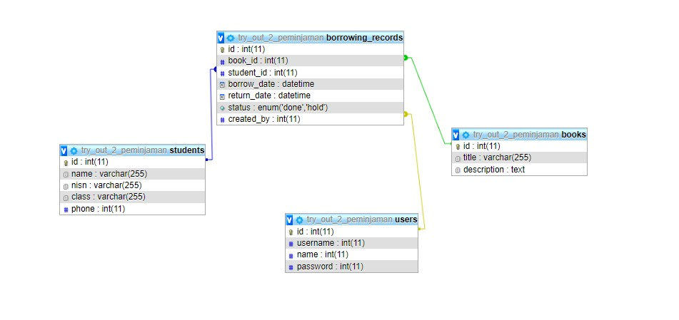
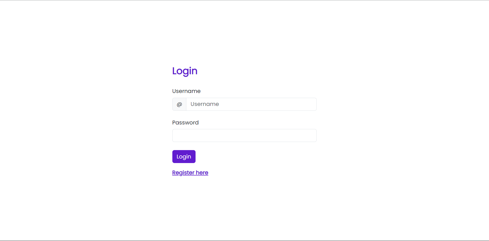
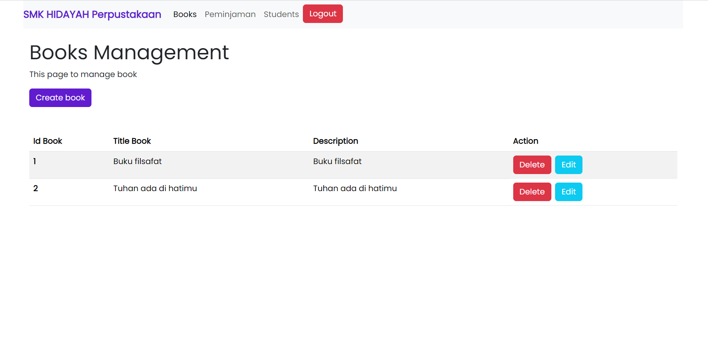

**README**

## Peminjaman Buku
GUNAKAN HANYA UNTUK PEMBELAJARAN TIDAK UNTUK DIGUNAKAN SAAT LSP BERJALAN ATAUPUN TRYOUT BERJALAN
By Ilham Maulana

### 1. Fitur

| Fitur          | Admin|
| ------         | ---- |
| Login          | X    |
| Logout         | X    |
| Buku CRUD      | X    |
| Peminjaman CRUD| X    |
| Students CRUD  | X    |

### 2. Design Database

Untuk melihat desain database, silakan lihat gambar berikut:



### Instalasi

Untuk menjalankan proyek, pastikan Anda telah melakukan langkah-langkah berikut:

1. Clone repositori atau download ini ke dalam direktori lokal Anda.
2. Pastikan Anda memiliki PHP dan server web yang sudah terpasang, Jalankan Xampp atau web server kalian.
3. Buatlah database sesuai dengan desain yang diberikan.
4. Import `data.sql` yang saya berikan.
5. Konfirgurasikan nama database kalian di db/Connection.php

```php
    private static $dbname = 'try_out_2_peminjaman';
```

Ganti nama database kalian

6. folder 'public' adalah folder utamanya, Contoh mengakses url: 
```
    http://localhost/perpustakaan_lsp/public/
```
7. Buka di browser.

8. Login ke dashboard mengunakan <br>

   username: `malana` <br>
   username: `rugidong`

   

9. Berhasil Login ke dashboard

   

### Kontak

Jika kalian memiliki pertanyaan atau masukan, jangan ragu untuk menghubungi saya melalui email atau media sosial yang tertera di profil saya.
